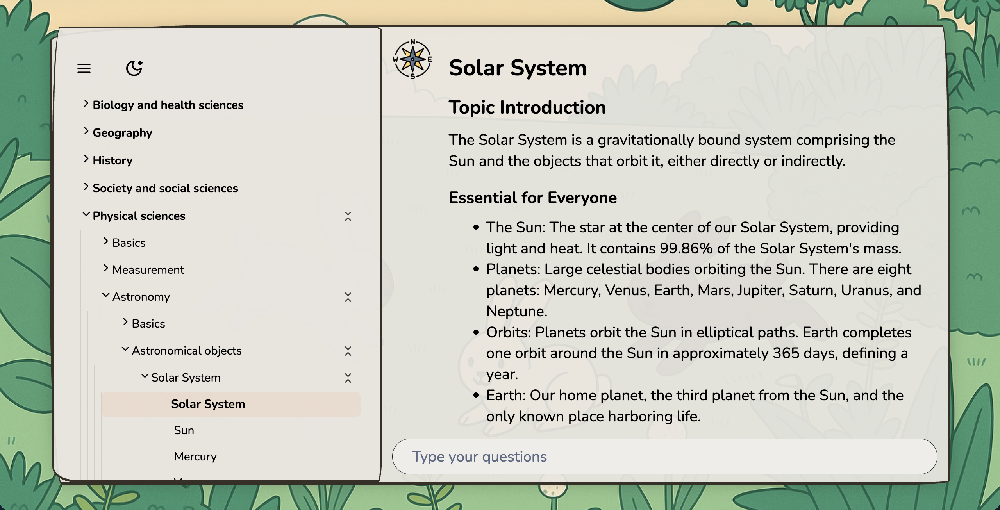

# Wiki Vital Chat

[](https://wiki-vital-chat.vercel.app/)

## Overview

This project is inspired by [Wikipedia:Vital articles](https://en.wikipedia.org/wiki/Wikipedia:Vital_articles), a curated collection of 50,000 articles selected from Wikipedia's 7+ million entries based on their importance to general knowledge. From this set, [level 4](https://en.wikipedia.org/wiki/Wikipedia:Vital_articles/Level/4) (the top 10,000 most vital articles) was chosen as the data source for this application.

The goal is to transform this vast resource into an easily digestible and interactive learning experience.

## Key Features

- **Hierarchical Navigation Panel**: Explore all 10,000 vital topics through an intuitive, dynamic tree-based interface that mirrors the original structure of the Wikipedia vital articles.

- **Structured Topic Summaries**: Clicking on any topic generates a concise, structured summary including:
    - A 20-word high-level introduction to the topic
    - Core knowledge broken down into four tiers:
	    1) Essential for Everyone
	    2) Important for Understanding
	    3) Useful for Deeper Knowledge
	    4) For Enthusiasts

- **LLM-Powered Chatbot**: Dive deeper into topics by asking follow-up questions to clarify concepts, explore related ideas, or test your understanding.

## Stack

- Data collection: BeautifulSoup4, Python
- Frontend: React, Next.js
- Backend: Next.js API Routes, Wikipedia API
- AI: Gemini-2.0-flash
- Deployment: Vercel

## Running Locally

Prerequisites: Node.js

1) Clone the repository

```
git clone https://github.com/changyuwh/wiki-vital-chat.git
cd wiki-vital-chat
```

2) Install dependencies and run the local server

```
npm install
npm run dev
```

It should now be accessible at [localhost:3000](http://localhost:3000), or the address displayed in your terminal.

3) Configure environment variables

Create a file named `.env.local` in the root directory of your project and add the following, replacing `your_gemini_api_key` with your actual key:

```
API_URL=https://generativelanguage.googleapis.com/v1beta/models/gemini-2.0-flash:generateContent
API_KEY=your_gemini_api_key
```


